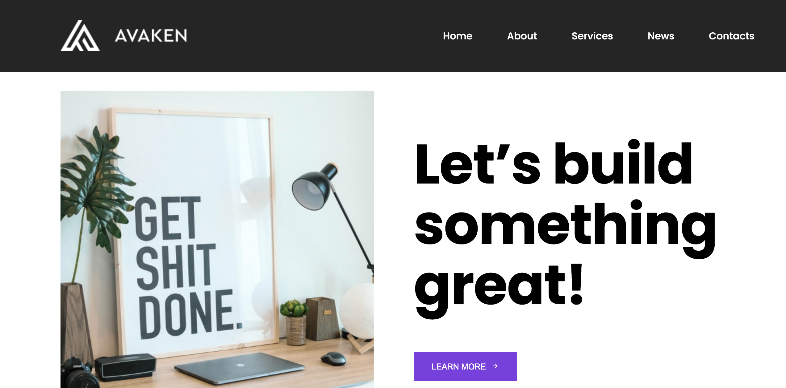

# Avaken

> This project build at the basic structure of HTML in web design. You can see the solutions in working with blocks, responsive design, crossbrowser compatible. 
> Live demo [_here_](https://yuliyazakharchuk.github.io/Avaken/). 

## Table of Contents

- [Avaken](#avaken)
  - [Table of Contents](#table-of-contents)
  - [General Information](#general-information)
  - [Technologies Used](#technologies-used)
  - [Screenshots](#screenshots)
  - [Setup](#setup)
  - [Usage](#usage)
  - [Project Status](#project-status)
  - [Contact](#contact)


## General Information

- The project consists of index.html, main.scss, images and javascript file.
- The purpose of your project was show work with grid and flex system.

## Technologies Used


- HTML
- SCSS
- JAVASCRIPT
- jQuery


## Screenshots





## Setup


To install the project, please, download it or clone and open project.

Then you can use it.

If you want edit project you would next steps:
```
npm install -g sass
```
Information about Install Sass  [_here_](https://sass-lang.com/).

Next step you would open project in Visual Studio Code or another redactor code.

Proceed to describe how to install / setup one's local environment / get started with the project.

## Usage


You can find realization of the change color of the header used jQuery.

```Js
$(window).on("scroll", function() {
    if ($(window).scrollTop() > 20) {
        $(".header").addClass("active");
        $(".logo").addClass("logo-active");
    } else {
        $(".header").removeClass("active");
        $(".logo").removeClass("logo-active");
    }
});
```
This project has sticky header, [JS Slider](https://swiperjs.com/), used BEM key concepts, used SCSS.
Actual time I had spent on this task was........ 
## Project Status


Project is: _complete_. 


## Contact


Created by [@Yuliya_Zakharchuk](https://github.com/YuliyaZakharchuk).


